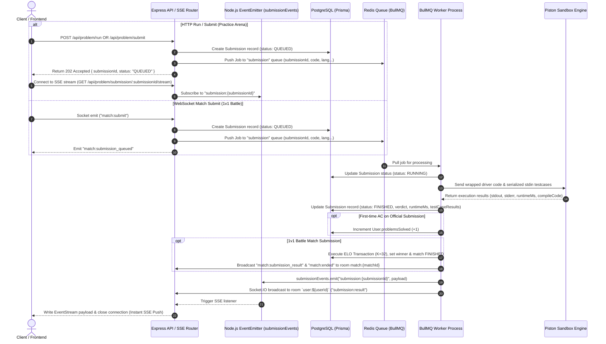

# ⚔️ CodeRival — BullMQ Code Execution Queue & Worker Architecture

This document provides a comprehensive deep dive into the **BullMQ Queue and Worker Architecture** used in **CodeRival** for processing code runs and submissions asynchronously, safely, and at high scale.

---

## 🏗️ 1. System Architecture & Complete Lifecycle Flow

CodeRival decouples API web servers from long-running code execution. When a user executes or submits code, the API records the request, enqueues a job into Redis via **BullMQ**, and immediately returns a `202 Accepted` response. Background worker processes consume these jobs, run user source code inside isolated **Piston** sandboxes, record verdicts in PostgreSQL, and push real-time results directly to the user's browser over **Server-Sent Events (SSE)** and **WebSockets**.

### **End-to-End Execution Sequence Diagram**



---

## 📁 2. Codebase Directory Map

All submission queue, worker, and execution files reside in `backend/src/modules/submission/` and `backend/src/utils/`:

```
backend/src/
├── config/
│   └── redis.ts                       # ioredis client with maxRetriesPerRequest: null
├── utils/
│   ├── driverGenerator.ts             # Hidden wrapper templates for Python, C++, and Java
│   ├── inputSerializer.ts             # Function signature stdin argument serializer
│   └── errors.ts                      # Custom error handler classes
├── modules/
│   ├── submission/
│   │   ├── submission.events.ts       # EventEmitter instance for SSE real-time events
│   │   ├── submission.queue.ts        # BullMQ Queue definition & metric helpers
│   │   ├── submission.worker.ts       # Worker processor loop & lifecycle handlers
│   │   ├── submission.service.ts      # High-level enqueue service layer
│   │   ├── execution.service.ts       # Piston integration & testcase verdict engine
│   │   ├── piston.service.ts          # Piston REST API client wrapper
│   │   ├── submission.types.ts        # TypeScript job interfaces
│   │   ├── submission.ratelimit.ts    # Redis sliding-window rate limiters
│   │   └── index.ts                   # Module exports
│   ├── problem/
│   │   ├── problem.controller.ts      # HTTP endpoints (/run, /submit, /submission/:id/stream)
│   │   └── problem.routes.ts          # Express router definition
│   └── match/
│       ├── match.service.ts           # 1v1 battle match resolution & ELO calculation
│       └── match.socket.ts            # Socket.IO match submission listeners
└── server.ts                          # Server startup & worker graceful shutdown
```

---

## ⚙️ 3. BullMQ Queue Configuration (`submission.queue.ts`)

The queue is initialized using BullMQ's `Queue` class connected to Redis.

```typescript
import { Queue } from "bullmq";
import { redis } from "../../config/redis";

export const SUBMISSION_QUEUE_NAME = "submission";

export const submissionQueue = new Queue(SUBMISSION_QUEUE_NAME, {
  connection: redis,
  defaultJobOptions: {
    attempts: 3,
    backoff: {
      type: "exponential",
      delay: 1000, // Retries at 1s, 2s, 4s
    },
    removeOnComplete: {
      age: 24 * 3600, // Retain completed jobs for 24h
      count: 1000,    // Keep last 1,000 completed jobs
    },
    removeOnFail: {
      age: 7 * 24 * 3600, // Retain failed jobs for 7 days
      count: 5000,        // Keep last 5,000 failed jobs
    },
  },
});
```

### **Job Data Payload (`SubmissionJobData`)**

```typescript
export interface SubmissionJobData {
  submissionId: string;
  userId: string;
  problemId: string;
  matchId?: string;
  language: "CPP" | "JAVA" | "PYTHON";
  sourceCode: string;
  submissionType: "RUN" | "SUBMIT";
}
```

---

## 🛠️ 4. Worker Processing Logic (`submission.worker.ts`)

The worker listens to the `submission` queue and executes jobs concurrently.

### **Step-by-Step Execution Lifecycle**:

1. **Mark Status `RUNNING`**: Updates database `Submission.status` from `QUEUED` to `RUNNING`.
2. **Generate Wrapper Code & Execute via Piston**:
   - Calls `ExecutionService.executeCode(...)`.
   - Wraps user code inside hidden driver templates (`driverGenerator.ts`) containing positional stdin JSON argument deserializers for Python 3.10, C++ (GCC 10.2), and Java (OpenJDK 15).
   - Sends code to Piston API endpoint (`PISTON_URL/api/v2/execute`).
3. **Evaluate Test Case Verdicts**:
   - **`CE` (Compilation Error)**: Compiler exit code $\ne 0$.
   - **`TLE` (Time Limit Exceeded)**: Execution duration exceeds problem `timeLimitMs` or returns `SIGKILL`.
   - **`RTE` (Runtime Error)**: Unhandled exception or non-zero exit code.
   - **`WA` (Wrong Answer)**: Output mismatch against expected target output.
   - **`AC` (Accepted)**: Output matches expected target across all test cases.
4. **Persist Results**:
   - Updates PostgreSQL `Submission` record with `status: FINISHED`, `verdict`, `runtimeMs`, `passedTestCases`, `totalTestCases`, `stderr`, and `testCaseResults`.
5. **Update User Progression**:
   - If official `SUBMIT` with `AC` verdict and first time solving problem, increments `user.problemsSolved`.
6. **1v1 Battle Resolution**:
   - If `matchId` is present, invokes `handleMatchSubmission(...)`. If verdict is `AC`, triggers atomic $K=32$ ELO transaction, sets winner, and marks match `FINISHED`.
7. **Real-Time Delivery (Server-Sent Events & Socket.IO)**:
   - Emits `submissionEvents.emit("submission:${submissionId}", payload)` to notify active SSE streams.
   - Emits `submission:result` directly to Socket.IO room `user:${userId}`.

---

## 📊 5. Database State Transition Lifecycle

```
[ HTTP / WS Request ] ──► DB: Submission Created (status: QUEUED)
                                 │
                                 ▼
                          BullMQ Redis Queue
                                 │
                                 ▼
                     Worker Picks Up Job
                                 │
                                 ▼
                          DB: Submission Updated (status: RUNNING)
                                 │
                                 ▼
                       Piston Sandbox Execution
                                 │
                                 ▼
                          DB: Submission Updated (status: FINISHED)
                               + Verdict (AC, WA, TLE, CE, etc.)
                                 │
                                 ▼
                     SSE Event Emit (submissionEvents)
```

---

## ⚡ 6. Real-Time Event-Driven Architecture (SSE & WebSockets)

CodeRival eliminated HTTP polling completely in favor of **Server-Sent Events (SSE)** and **WebSockets**:

| Channel | Mechanism | Latency | Usage |
| :--- | :--- | :--- | :--- |
| **Server-Sent Events (SSE)** | `GET /api/problem/submission/:id/stream` | **<50ms** | Practice Arena code execution (`RUN` / `SUBMIT`) |
| **Socket.IO Push** | Socket room `user:${userId}` & `match:${matchId}` | **<50ms** | 1v1 Battle matches real-time progression |

### **Why Polling Was Eliminated**:
- **Zero Polling Overhead**: Eliminates continuous HTTP GET requests hitting backend servers and database.
- **Immediate Push**: Results stream to client the exact millisecond execution finishes in BullMQ worker.
- **Low Memory Footprint**: Uses Node.js `EventEmitter` to push response down open HTTP event streams.

---

## 🖥️ 7. Process Architecture: Embedded vs. Standalone Worker

### **Option A: Embedded Worker (Dev & MVP)**
- Worker runs inside `server.ts` alongside Express and Socket.IO via `startSubmissionWorker()`.
- **Best for**: Local testing, single-server VPS setups.

### **Option B: Standalone Worker Process (Production Microservice)**
- Express API nodes handle HTTP/WS/SSE connections separately, while dedicated worker processes consume jobs from the shared Redis queue.
- **Best for**: High-concurrency production deployments.

```
                         ┌─────────────────────────┐
                         │   Cloudflare WAF / SSL  │
                         └────────────┬────────────┘
                                      │
                         ┌────────────▼────────────┐
                         │   Nginx Reverse Proxy   │
                         └──────┬────────────┬─────┘
                                │            │
            ┌───────────────────┘            └───────────────────┐
            ▼                                                    ▼
┌───────────────────────┐                            ┌───────────────────────┐
│   Express API Node 1  │                            │   Express API Node 2  │
│  (HTTP / SSE / WS)    │                            │  (HTTP / SSE / WS)    │
└───────────┬───────────┘                            └───────────┬───────────┘
            │                                                    │
            └───────────────────┬────────────────────────────────┘
                                ▼
                      ┌───────────────────┐
                      │    Redis Queue    │
                      └─────────┬─────────┘
                                │
            ┌───────────────────┴───────────────────┐
            ▼                                       ▼
┌───────────────────────┐               ┌───────────────────────┐
│ Dedicated Worker Pod 1│               │ Dedicated Worker Pod 2│
│ (BullMQ Concurrency=5)│               │ (BullMQ Concurrency=5)│
└───────────────────────┘               └───────────────────────┘
```

---

## 🚀 8. Production PM2 & Docker Deployment Guide

### **PM2 Configuration (`ecosystem.config.js`)**

```javascript
module.exports = {
  apps: [
    {
      name: "coderival-api",
      script: "./dist/server.js",
      instances: "max",
      exec_mode: "cluster",
      env: {
        NODE_ENV: "production",
        PORT: 8000,
      },
    },
    {
      name: "coderival-worker",
      script: "./dist/worker.js",
      instances: 2,
      env: {
        NODE_ENV: "production",
        SUBMISSION_WORKER_CONCURRENCY: 5,
      },
    },
  ],
};
```

### **Docker Compose Multi-Container (`docker-compose.prod.yml`)**

```yaml
version: '3.8'

services:
  redis:
    image: redis:7-alpine
    restart: always
    ports:
      - "6379:6379"

  api:
    build:
      context: ./backend
      dockerfile: Dockerfile
    command: npm start
    ports:
      - "8000:8000"
    environment:
      - PORT=8000
      - DATABASE_URL=postgresql://user:pass@db:5432/coderival
      - REDIS_URL=redis://redis:6379
      - PISTON_URL=http://piston:2000
    depends_on:
      - redis

  worker:
    build:
      context: ./backend
      dockerfile: Dockerfile
    command: npm run start:worker
    environment:
      - DATABASE_URL=postgresql://user:pass@db:5432/coderival
      - REDIS_URL=redis://redis:6379
      - PISTON_URL=http://piston:2000
      - SUBMISSION_WORKER_CONCURRENCY=5
    depends_on:
      - redis
```
