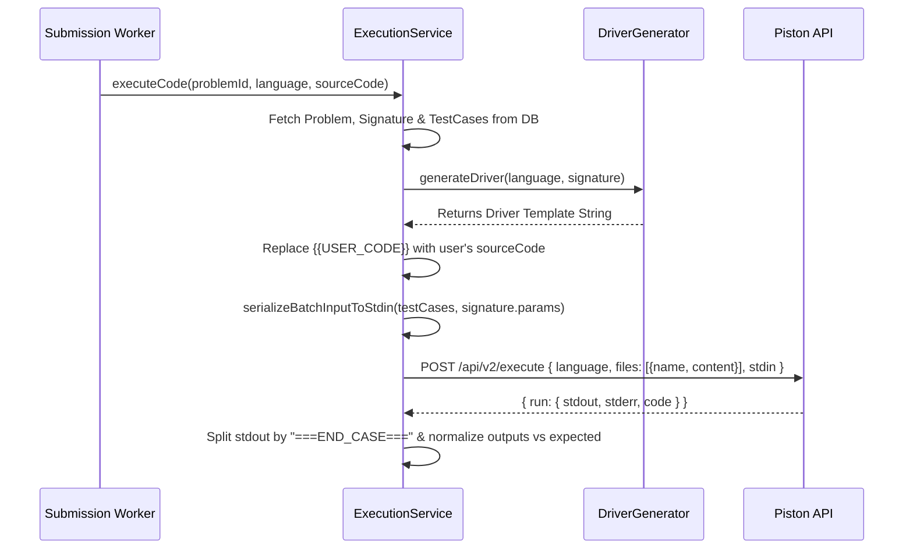

# CodeRival Execution Driver Architecture & Documentation

## 1. Overview & Architecture

CodeRival executes user-submitted code in isolated environments using the **Piston** code execution engine. To evaluate a candidate's solution without requiring them to write boilerplate I/O code, CodeRival automatically wraps the user's `Solution` class with a dynamically generated **Driver**.

### Key Design Principles

1. **On-the-Fly Driver Generation**: Drivers are **not** stored in the database. Instead, whenever a user submits code (or runs sample tests), `ExecutionService` fetches the problem's language-agnostic `ProblemSignature` and generates the driver code dynamically using `generateDriver(language, signature)` in `src/utils/driverGenerator.ts`.
2. **Batch Test Case Execution (Single Compile & Run)**: Rather than making sequential HTTP requests and compiling code separately for every testcase, CodeRival packs **all test cases** into a single STDIN payload and sends **1 HTTP request** to Piston per submission.
3. **Deterministic Standard I/O Protocol**: Inputs are converted into a standardized stream of STDIN tokens prefixed with test case count `T`, and stdout outputs are delimited by `===END_CASE===`.

---

## 2. Driver Generation Workflow

When a submission is evaluated in `ExecutionService`:



### Type Mapping Across Languages

| Canonical Type | C++ Type | Java Type | Python Type |
| :--- | :--- | :--- | :--- |
| `int` | `int` | `int` | `int` |
| `double` | `double` | `double` | `float` |
| `string` | `string` | `String` | `str` |
| `boolean` | `bool` | `boolean` | `bool` |
| `int[]` | `vector<int>` | `int[]` | `List[int]` |
| `double[]` | `vector<double>` | `double[]` | `List[float]` |
| `string[]` | `vector<string>` | `String[]` | `List[str]` |
| `boolean[]` | `vector<bool>` | `boolean[]` | `List[bool]` |
| `int[][]` | `vector<vector<int>>` | `int[][]` | `List[List[int]]` |
| `void` | `void` | `void` | `None` |

---

## 3. Batch STDIN & Output Serialization Protocol

### Batch STDIN Protocol

Parameters for all test cases are serialized into a single string starting with the **number of test cases ($T$)**:

```text
<T>
<TC_1_PARAM_1_TOKENS>
<TC_1_PARAM_2_TOKENS>
...
<TC_2_PARAM_1_TOKENS>
...
```

For example, 2 test cases for Two Sum:
- Test Case 1: `nums = [2,7,11,15]`, `target = 9`
- Test Case 2: `nums = [3,2,4]`, `target = 6`

**Batch STDIN Stream**:
```text
2
4
2
7
11
15
9
3
3
2
4
6
```

### Output (STDOUT) Protocol

Drivers execute a loop for `T` test cases and print `===END_CASE===` after each test case output:

```text
0 1
===END_CASE===
1 2
===END_CASE===
```

---

## 4. Language-Specific Driver Implementation & Optimizations

### C++ Driver
- **Fast I/O**: `ios_base::sync_with_stdio(false); cin.tie(NULL);`
- **Batch Loop**: `cin >> num_test_cases; for (int tc = 0; tc < num_test_cases; ++tc)`
- **Delimiter**: `cout << "===END_CASE===\n";`

### Java Driver
- **Fast I/O**: `StreamTokenizer` + `BufferedReader` + `BufferedWriter` to minimize GC overhead and I/O latency.
- **Piston Class Placement**: `public class Main` is defined **first** in the generated file, and `{{USER_CODE}}` (`class Solution`) is placed **after** `Main`. This ensures Piston targets `Main.main()` as the entry point instead of searching for a non-existent `main()` inside `Solution`.
- **Batch Loop**: `int numTestCases = nextInt(); for (int tc = 0; tc < numTestCases; tc++)`

### Python Driver
- **Token Iterator**: Reads entire STDIN once via `sys.stdin.read().split()` and iterates tokens (`_next_token()`).
- **Batch Loop**: `num_test_cases = int(_next_token()); for _ in range(num_test_cases):`

---

## 5. Sample Code Sent to Piston (Batch Mode)

Below is a full example for **Problem #1: Two Sum**.

- **Signature**:
  - `functionName`: `"twoSum"`
  - `returnType`: `"int[]"`
  - `params`: `[{"name": "nums", "type": "int[]"}, {"name": "target", "type": "int"}]`

- **User Code (`sourceCode`)**:
  ```java
  class Solution {
      public int[] twoSum(int[] nums, int target) {
          Map<Integer, Integer> map = new HashMap<>();
          for (int i = 0; i < nums.length; i++) {
              int complement = target - nums[i];
              if (map.containsKey(complement)) {
                  return new int[] { map.get(complement), i };
              }
              map.put(nums[i], i);
          }
          return new int[] {};
      }
  }
  ```

---

### Sample 1: C++ Driver Payload Sent to Piston (`main.cpp`)

```cpp
#include <bits/stdc++.h>
#include <iostream>
#include <vector>
#include <string>
#include <sstream>
#include <iomanip>
#include <algorithm>

using namespace std;

string format_double(double val) {
    ostringstream oss;
    oss << fixed << setprecision(6) << val;
    return oss.str();
}

int parse_int() {
    int val;
    if (!(cin >> val)) return 0;
    return val;
}

vector<int> parse_int_array() {
    int n;
    if (!(cin >> n)) return {};
    vector<int> arr(n);
    for (int i = 0; i < n; ++i) {
        cin >> arr[i];
    }
    return arr;
}

void serialize_and_print(const vector<int>& arr) {
    for (size_t i = 0; i < arr.size(); ++i) {
        cout << arr[i] << (i + 1 == arr.size() ? "" : " ");
    }
    cout << endl;
}

class Solution {
public:
    vector<int> twoSum(vector<int>& nums, int target) {
        unordered_map<int, int> mp;
        for (int i = 0; i < nums.size(); ++i) {
            int comp = target - nums[i];
            if (mp.count(comp)) return {mp[comp], i};
            mp[nums[i]] = i;
        }
        return {};
    }
};

int main() {
    ios_base::sync_with_stdio(false);
    cin.tie(NULL);
    int num_test_cases = 0;
    if (!(cin >> num_test_cases)) return 0;
    Solution sol;
    for (int tc = 0; tc < num_test_cases; ++tc) {
        auto nums = parse_int_array();
        auto target = parse_int();
        auto result = sol.twoSum(nums, target);
        serialize_and_print(result);
        cout << "===END_CASE===" << endl;
    }
    return 0;
}
```

---

### Sample 2: Java Driver Payload Sent to Piston (`Main.java`)

```java
import java.util.*;
import java.io.*;

public class Main {
    private static StreamTokenizer st;
    private static BufferedWriter bw;

    private static void initIO() throws IOException {
        st = new StreamTokenizer(new BufferedReader(new InputStreamReader(System.in)));
        st.ordinaryChars(0, 255);
        st.wordChars(33, 255);
        st.whitespaceChars(0, 32);
        bw = new BufferedWriter(new OutputStreamWriter(System.out));
    }

    private static int nextInt() throws IOException {
        st.nextToken();
        return Integer.parseInt(st.sval);
    }

    private static int[] nextIntArray() throws IOException {
        int n = nextInt();
        int[] arr = new int[n];
        for (int i = 0; i < n; i++) arr[i] = nextInt();
        return arr;
    }

    private static void printResult(int[] arr) throws IOException {
        StringBuilder sb = new StringBuilder();
        for (int i = 0; i < arr.length; i++) {
            if (i > 0) sb.append(' ');
            sb.append(arr[i]);
        }
        bw.write(sb.toString());
        bw.newLine();
    }

    public static void main(String[] args) throws IOException {
        initIO();
        int numTestCases = nextInt();
        Solution sol = new Solution();
        for (int tc = 0; tc < numTestCases; tc++) {
            int[] nums = nextIntArray();
            int target = nextInt();
            int[] result = sol.twoSum(nums, target);
            printResult(result);
            bw.write("===END_CASE===");
            bw.newLine();
        }
        bw.flush();
    }
}

class Solution {
    public int[] twoSum(int[] nums, int target) {
        Map<Integer, Integer> map = new HashMap<>();
        for (int i = 0; i < nums.length; i++) {
            int complement = target - nums[i];
            if (map.containsKey(complement)) {
                return new int[] { map.get(complement), i };
            }
            map.put(nums[i], i);
        }
        return new int[] {};
    }
}
```

---

### Sample 3: Python Driver Payload Sent to Piston (`main.py`)

```python
import sys
import math
import heapq
import bisect
import functools
from collections import defaultdict, deque, Counter, OrderedDict
from typing import List, Dict, Tuple, Optional

# ── Token-based stdin reader (mirrors C++ cin >> behaviour) ──
_tokens = iter(sys.stdin.read().split())

def _next_token():
    return next(_tokens, "")

def _next_int():
    t = _next_token()
    return int(t) if t else 0

def _next_int_array():
    n = _next_int()
    return [_next_int() for _ in range(n)]

def _serialize(val, val_type):
    if val is None or val_type == "void":
        return ""
    if val_type == "int[]":
        return " ".join(map(str, val))
    return str(val)

class Solution:
    def twoSum(self, nums: List[int], target: int) -> List[int]:
        seen = {}
        for i, num in enumerate(nums):
            comp = target - num
            if comp in seen:
                return [seen[comp], i]
            seen[num] = i
        return []

if __name__ == "__main__":
    t_str = _next_token()
    num_test_cases = int(t_str) if t_str else 0
    sol = Solution()
    for _ in range(num_test_cases):
        nums = _next_int_array()
        target = _next_int()
        try:
            result = sol.twoSum(nums, target)
            print(_serialize(result, "int[]"))
            print("===END_CASE===")
        except Exception as e:
            print(e, file=sys.stderr)
            print("===END_CASE===")
            sys.exit(1)
```
