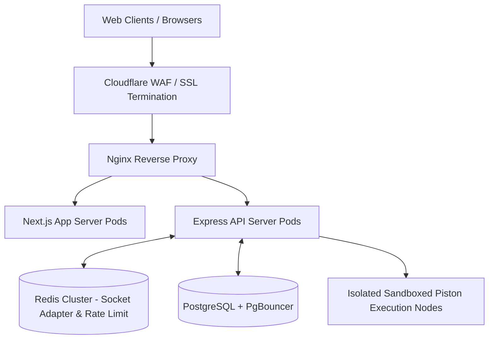
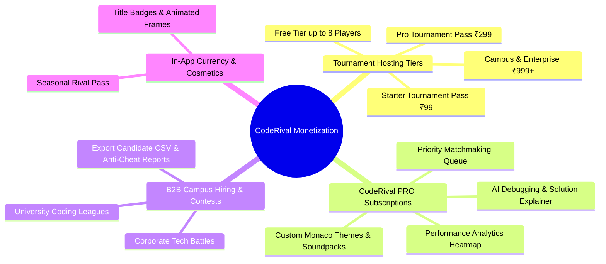
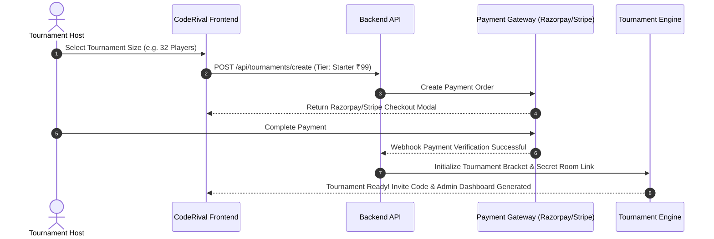
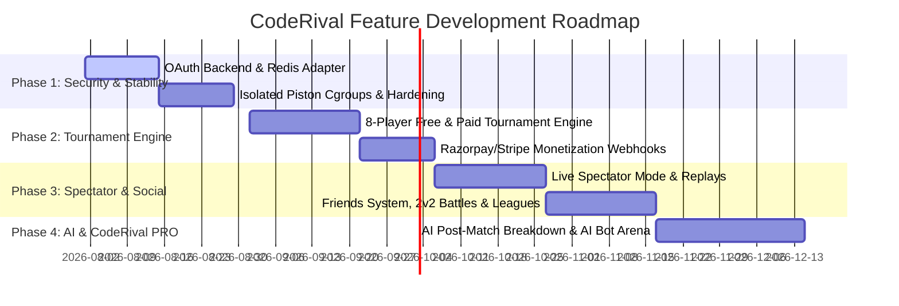

# 🔮 CodeRival — Product Readiness, Security Audit & Future Strategy

This document serves as the master production blueprint for **CodeRival**, detailing the current architectural status, MVP readiness, pre-deployment checklist, security vulnerability audit, feature expansion roadmap, and **monetization & business model strategy**.

---

## 📊 Executive Summary & Readiness Dashboard

| Category | Readiness Score | Status | Key Highlights |
| :--- | :---: | :---: | :--- |
| **MVP Core Loop** | **92%** | 🟢 **Alpha/Beta Ready** | Complete 1v1 real-time duel queue, dual Monaco code synchronization, Piston code execution, ELO rating engine ($K=32$), solo practice arena, and protected routes. |
| **Deployment & Ops** | **75%** | 🟡 **Pre-Production** | Docker Compose for Redis running; needs Redis Socket.IO adapter for scaling, sandboxed Piston cluster, HTTPS/WSS reverse proxy, database connection pooling, and health monitoring. |
| **Security & Hardening** | **85%** | 🟢 **Hardened** | Redis sliding window rate limiting on auth and execution endpoints, IP/Email tracking, fail-open resilience. Sandbox resource isolation and socket room auth verification pending. |
| **Monetization Architecture** | **0% (Planned)** | 🔵 **Architecture Ready** | Detailed freemium tournament hosting models (Free up to 8 players, ₹99 for 32 players, ₹299 for 128 players, ₹999+ Enterprise), CodeRival PRO subscriptions, and sponsored hiring contests. |

---

## 🏗️ 1. Current Codebase Capabilities Audit

### 💻 Frontend Architecture (Next.js 16 + React 19 + Tailwind v4)
- **Session & Route Protection (`AuthProvider`)**:
  - Automatically redirects authenticated users away from unauthenticated pages (`/`, `/signin`, `/register`, `/forgot-password`) to `/dashboard`.
  - Enforces session checks on protected routes (`/dashboard`, `/battles`, `/problems`, `/profile`), redirecting unauthenticated traffic to `/signin`.
  - Zero-layout-flash loading indicators maintain seamless transition states.
- **1v1 Battle Arena (`/battles/[id]`)**:
  - Dual-way Socket.IO synchronization for real-time code typing and opponent preview.
  - Multi-language Monaco Code Editor with starter code and wrapper support for **Python 3**, **C++**, and **Java 17**.
  - 15-minute duel countdown timer, opponent disconnect grace period (30s countdown), match activity event log.
  - Forfeit match modal with instant rating penalty calculation and victory/defeat breakdown modals.
- **Matchmaking Engine (`/battles`)**:
  - Dynamic ELO matchmaking queue with expanding rating windows over time ($\pm 100 \rightarrow \pm 500 \rightarrow \text{unrestricted}$).
  - Live opponent found overlay with 3-second transition buffer.
  - Competitive stats summary cards and match history feed.
- **Solo Practice Arena (`/problems` & `/problems/[slug]`)**:
  - Filterable problem repository by difficulty (*Easy, Medium, Hard*) and topic tags.
  - Interactive "Run Code" execution against sample testcases and full problem submission engine.
  - Historical submissions tab with source code inspect modal and execution metrics.

### ⚙️ Backend Architecture (Express + TypeScript + Prisma + Socket.IO)
- **Data Persistence (PostgreSQL + Prisma ORM)**:
  - Relational schema covering `User`, `RatingHistory`, `Problem`, `Topic`, `ProblemExample`, `ProblemSignature`, `ProblemStarterCode`, `ProblemDriver`, `ProblemTestCase`, `Match`, and `Submission`.
- **Real-Time Engine (Socket.IO)**:
  - Room management for match updates (`match:join_room`, `match:code_sync`, `match:submit_code`, `match:forfeit`, `matchmaking:join`).
  - Disconnect handling with 30-second reconnect window and automated forfeit triggers.
- **Execution Judge Service (`ExecutionService` + Piston API)**:
  - Positional argument input serialization matching problem function signatures.
  - Dynamic language drivers with `{{USER_CODE}}` string replacement enforcing strict solution signatures.
  - Evaluates verdicts: `AC` (Accepted), `WA` (Wrong Answer), `TLE` (Time Limit Exceeded), `CE` (Compilation Error), `RTE` (Runtime Error), `MLE` (Memory Limit Exceeded).
- **Competitive Rating Engine**:
  - Automated ELO updates using standard formula ($K=32$):
    $$E_A = \frac{1}{1 + 10^{(R_B - R_A)/400}}, \quad R'_A = R_A + K \cdot (S_A - E_A)$$

---

## 🚀 2. MVP Launch & Pre-Deployment Checklist

### Is CodeRival MVP Ready? — **YES (92%)**

#### ✅ Completed Features for MVP:
1. End-to-end user loop: Register/Login $\rightarrow$ Queue $\rightarrow$ 1v1 Duel Arena $\rightarrow$ Judge Evaluation $\rightarrow$ ELO Rating Update.
2. Real-time dual socket synchronization with 30s disconnect resilience.
3. Multi-language support (C++, Java, Python) with driver signature enforcement.
4. Monaco code editor with dark cyber design system and dynamic ELO tier badges.

#### 🛠️ Blockers to Reach 100% Launch MVP:
- [ ] **Problem Bank Seeding**: Seed database with at least 30–50 competitive programming problems across Easy, Medium, and Hard difficulties.
- [ ] **OAuth Backend Integration**: Wire up backend passport/JWT handlers for GitHub and Google OAuth buttons on the frontend.
- [ ] **Transactional Email Service**: Integrate Resend or AWS SES for real email OTP verification and password resets.
- [ ] **Mobile Responsiveness Polish**: Enhance editor layout on tablet and mobile viewports with collapsible tabs.

---

### 📋 Pre-Production Infrastructure Checklist

Before opening CodeRival to public users, complete the following deployment steps:

```
┌───────────────────────────────────────────────────────────┐
│              Production Deployment Checklist              │
├──────────────────────────┬────────┬───────────────────────┤
│ Requirement              │ Status │ Solution              │
├──────────────────────────┼────────┼───────────────────────┤
│ Redis Socket.IO Adapter  │ ❌ No  │ Add @socket.io/redis  │
│ API Rate Limiting        │ ✅ Yes │ Redis Sliding Window  │
│ Isolated Piston Sandbox  │ ⚠️ Local│ Strict Docker Cgroups │
│ HTTPS / WSS SSL Certs    │ ❌ No  │ Cloudflare / Certbot  │
│ Database Connection Pool │ ⚠️ Basic│ PgBouncer / Aurora    │
│ Health & Metrics API     │ ❌ No  │ Add /healthz & Prometheus│
│ Docker Multi-Stage Build │ ❌ No  │ Production Dockerfiles│
│ CI/CD Automated Pipelines│ ❌ No  │ GitHub Actions Workflow│
└──────────────────────────┴────────┴───────────────────────┘
```

#### Production Architecture Topology:


---

## 🔒 3. Security Vulnerability & Hardening Audit

> [!IMPORTANT]
> Competitive programming platforms face unique security challenges due to executing untrusted user-submitted code and maintaining real-time match integrity.

### 🚨 Vulnerability Analysis & Countermeasures

#### 1. Code Execution Engine Isolation (Critical Risk)
- **Vulnerability**: Executing untrusted code via Piston on an unisolated host allows container escape, resource exhaustion (fork bombs), local network scanning, or host environment variable theft.
- **Remediation**:
  - Deploy Piston in strict isolated Docker containers with `--net=none` (no external network access).
  - Enforce Linux cgroup restrictions (`--memory=256m`, `--cpus=0.5`, `--pids-limit=64`).
  - Set hard execution timeouts: `compile_timeout: 5000ms`, `run_timeout: 2000ms`.
  - Mount read-only root filesystems for execution workers.

#### 2. WebSocket Room Authorization & Event Spoofing (High Risk)
- **Vulnerability**: If `match:join_room` or code submission socket handlers accept `matchId` without validating that `socket.user.id` matches `player1Id` or `player2Id`, malicious users can hijack match rooms or send fake forfeit events.
- **Remediation**:
  - Implement match ownership checks inside socket event middleware:
    ```typescript
    const match = await prisma.match.findUnique({ where: { id: matchId } });
    if (match.player1Id !== socket.user.id && match.player2Id !== socket.user.id) {
      return socket.emit("error", { message: "Unauthorized room access" });
    }
    ```

#### 3. API Denial of Service & Rate Limiting (High Risk — ✅ RESOLVED)
- **Status**: Implemented modular Redis Sliding Window Rate Limiting (`/backend/src/lib/rate-limit`):
  - **Auth**: `signinLimiter` (10 req/15min), `registerLimiter` (5 req/15min), `verifyOTP` (5 req/15min).
  - **Judge Execution**: `runCodeLimiter` (10 req/min per user/IP), `submitCodeLimiter` (5 req/min per user/IP).
  - **Debounced Checks**: Username validation (`/api/user/check_username`) unthrottled for fluid UX.

#### 4. Anti-Cheat & Plagiarism Detection Engine (Medium Risk)
- **Vulnerability**: Users copying solutions from ChatGPT or LeetCode, or leaving the battle tab to look up solutions.
- **Remediation**:
  - **Tab Focus Tracking**: Detect `document.visibilityState` changes and log warnings to the match event feed.
  - **Copy-Paste Lock**: Optional toggle to disable external paste events inside Monaco Editor for ranked matches.
  - **Code Similarity AST Analyzer**: Execute automated MOSS (Measure of Software Similarity) or AST token comparison on winning solutions.

#### 5. Database Trace Masking & Information Leakage (Low-Medium Risk)
- **Remediation**: Ensure Express error handling middleware suppresses internal stack traces and Prisma query logs when `NODE_ENV=production`.

---

## 💰 4. Monetization & Business Model Strategy

CodeRival can leverage a multi-tiered monetization strategy that caters to individual competitive programmers, university campus coding clubs, and enterprise tech recruiters.



---

### 💸 Tier 1: Tournament Hosting Pricing (Pay-Per-Tournament)

Enable users, creators, college clubs, and communities to host custom tournaments on CodeRival.

| Tournament Tier | Price (INR / USD) | Player Limit | Features Included | Best For |
| :--- | :--- | :---: | :--- | :--- |
| **Community Free** | **Free** | **Up to 8 Players** | Single Knockout, Random Problem Selection, Standard Leaderboard. | Casual friends, quick 1v1 / 4v4 lobbies. |
| **Starter Tournament Pass** | **₹99** (~$1.20) | **Up to 32 Players** | Single & Double Elimination, Custom Problem Selection, Custom Time Limits, Spectator Link. | College clubs, Discord communities, small online contests. |
| **Pro Tournament Pass** | **₹299** (~$3.60) | **Up to 128 Players** | Swiss-System & Knockout Brackets, Custom Problem Creation, Anti-Cheat Log Export, Live Stream Embed. | Regional coding leagues, tech influencers, bootcamp hackathons. |
| **Enterprise / Campus Pass** | **₹999 – ₹4,999** (~$12 – $60) | **Unlimited Players** | Custom Branding, Dedicated Judge Server Instance, Plagiarism Detection Report, Candidate Score Export (CSV/PDF). | University placement drives, corporate hiring hackathons. |

#### Tournament Creation & Payment Flow:


---

### ⭐ Tier 2: "CodeRival PRO" Freemium Subscription

Target individual developers seeking to improve their competitive coding speed and ratings.

- **Pricing**: **₹199 / month** (~$2.49/mo) or **₹1,799 / year** (~$21.99/yr)
- **PRO Exclusive Features**:
  1. **AI Code Assistant & Post-Match Explainer**:
     - Instant AI breakdown explaining why a submission failed (e.g., "Your code failed on edge case $N=0$ due to integer overflow").
     - Time & Space complexity analysis ($\mathcal{O}(N \log N)$ vs $\mathcal{O}(N^2)$ recommendation).
  2. **Detailed Analytics & Weakness Heatmap**:
     - Topic performance breakdown (*Dynamic Programming: 65% accuracy, Graph Theory: 40% accuracy*).
     - ELO trajectory projection and typing speed vs logic execution metrics.
  3. **Customization & Cosmetics**:
     - Exclusive Monaco Editor Themes (Cyberpunk Neon, Dracula Pro, Tokyo Night, Monokai Pro).
     - Custom Audio Soundpacks (Mechanical Keyboard Switches, Retro Arcade Victory Sounds, Announcer Voices).
     - Animated ELO Tier Badges, Profile Banners, and Custom Avatar Glows.
  4. **QoL Perks**:
     - Priority Matchmaking Queue (faster opponent pairing during peak hours).
     - Unlimited creation of 8-player community lobbies with zero cool-down.

---

### 🏢 Tier 3: Sponsored Contests & B2B Tech Recruitment

Monetize through employer branding and developer talent discovery:
- **Sponsored Prize Tournaments**: Tech companies sponsor a ₹50,000 prize pool contest (e.g. *"Swiggy Code Sprint"*).
- **Recruiting Access**: Companies pay CodeRival a platform fee to access top 5% leaderboard candidates with consent, complete with verified anti-cheat integrity reports.

---

### 🎮 Tier 4: In-App Currency & Seasonal "Rival Pass"

- **Rival Coins (In-App Currency)**: Earned via winning matches or purchased directly.
- **Seasonal Rival Pass (₹149 / Season)**: Tiered progression pass unlocking seasonal badges, titles (*"Algorithm Master"*, *"Bug Hunter"*), and custom battle entry animations.

---

## 🛣️ 5. Comprehensive Feature Expansion Roadmap



---

### Phase 1: Security, Hardening & Pre-Production (Immediate)
- [x] Redis sliding window rate limiting on auth and execution API routes.
- [ ] `@socket.io/redis-adapter` for multi-node backend scaling.
- [ ] Strict Piston container isolation (`--net=none`, CPU/RAM cgroups).
- [ ] Socket event membership authorization guards on all `match:*` rooms.
- [ ] Centralized structured logger (Pino/Winston) with production trace masking.

### Phase 2: Tournament Engine & Monetization Infrastructure
- [ ] **Tournament Bracket Engine**: Support Single Elimination, Double Elimination, and Swiss-System brackets.
- [ ] **Payment Gateway Integration**: Razorpay (India) & Stripe (Global) webhooks for purchasing Tournament Passes and PRO subscriptions.
- [ ] **Custom Battle Lobbies**: Private battle rooms with custom time limits, language filters, and invite links.

### Phase 3: Spectator Mode & Social Systems
- [ ] **Live Spectator Mode**: Allow users to watch ongoing high-ranking duels with real-time editor updates and commentary feed.
- [ ] **Match Replay Engine**: Replay matches step-by-step from stored socket delta buffers.
- [ ] **Social Features**: Friend list, direct battle challenges, global chat channels, and 2v2 Team Battles.
- [ ] **Seasonal Leagues**: Seasonal ELO resets with tier rewards (Bronze, Silver, Gold, Platinum, Diamond, Master, Grandmaster).

### Phase 4: AI Integration & CodeRival PRO
- [ ] **AI Practice Bot**: Solo battle arena against AI bots tuned to specific ELO levels (1200, 1500, 1800, 2200).
- [ ] **AI Code Explainer & Assistant**: Post-match submission analysis detailing edge cases and optimization tips.
- [ ] **Anti-Cheat AST Similarity Engine**: Automated MOSS / AST code similarity detection for contest integrity.

---

## 📌 Summary of Next Actionable Steps

1. **Populate Problem Bank**: Seed PostgreSQL with 30+ problem signatures and testcase drivers.
2. **Setup Payment Gateway**: Register Razorpay / Stripe merchant account and create API routes for Tournament Passes.
3. **Harden Piston Infrastructure**: Configure Docker compose with isolated network namespaces and resource limits.
4. **Deploy Staging Server**: Launch Dockerized backend, frontend, Redis, and PostgreSQL on AWS EC2 or Hetzner with Cloudflare SSL.
