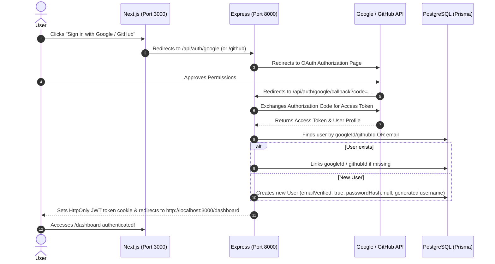

# 🔐 Google & GitHub OAuth 2.0 Integration Guide

This guide provides a comprehensive, step-by-step walkthrough for implementing **Google** and **GitHub** OAuth 2.0 authentication in **CodeRival**.

---

## 📐 1. OAuth 2.0 Architecture & Authentication Flow

CodeRival uses the standard **OAuth 2.0 Authorization Code Grant Flow**. When a user clicks **Sign in with Google** or **Sign in with GitHub**, the browser is directed to the provider, receives an authorization code, exchanges it on the backend for user profile information, creates/links the user in PostgreSQL via Prisma, and sets a secure `token` JWT HTTP-Only cookie before redirecting back to the Next.js frontend dashboard.



---

## 🛠️ 2. Step 1: Provider Developer Credentials Setup

Before touching code, you must obtain Client IDs and Secrets from Google and GitHub developer consoles.

### 🔵 A. Google Cloud Console Setup

1. Go to the [Google Cloud Console](https://console.cloud.google.com/).
2. Create a new project (e.g., `CodeRival-Production`).
3. Navigate to **APIs & Services** $\rightarrow$ **OAuth consent screen**:
   - User Type: **External**.
   - App Name: `CodeRival`.
   - User Support Email: Your email.
   - Developer Contact Information: Your email.
   - Scopes: Add `userinfo.email` and `userinfo.profile`.
4. Navigate to **APIs & Services** $\rightarrow$ **Credentials**:
   - Click **Create Credentials** $\rightarrow$ **OAuth client ID**.
   - Application type: **Web application**.
   - Name: `CodeRival Web Client`.
   - **Authorized JavaScript origins**:
     - `http://localhost:8000`
     - `http://localhost:3000`
   - **Authorized redirect URIs**:
     - `http://localhost:8000/api/auth/google/callback`
5. Click **Create** and save your:
   - `GOOGLE_CLIENT_ID`
   - `GOOGLE_CLIENT_SECRET`

---

### 🐙 B. GitHub Developer Settings Setup

1. Go to your [GitHub Developer Settings](https://github.com/settings/developers).
2. Click **OAuth Apps** $\rightarrow$ **Register a new application**.
3. Fill in the application details:
   - Application Name: `CodeRival`
   - Homepage URL: `http://localhost:3000`
   - Authorization callback URL: `http://localhost:8000/api/auth/github/callback`
4. Click **Register application**.
5. Click **Generate a new client secret**.
6. Save your:
   - `GITHUB_CLIENT_ID`
   - `GITHUB_CLIENT_SECRET`

---

## 📦 3. Step 2: Install Backend Dependencies

Navigate to your backend directory and install `passport` along with the Google & GitHub strategies:

```bash
cd backend
npm install passport passport-google-oauth20 passport-github2
npm install -D @types/passport @types/passport-google-oauth20 @types/passport-github2
```

---

## ⚙️ 4. Step 3: Update Environment Configuration

### Backend `.env` (`/backend/.env`)
Add your credentials to `backend/.env`:

```env
GOOGLE_CLIENT_ID="your-google-client-id.apps.googleusercontent.com"
GOOGLE_CLIENT_SECRET="your-google-client-secret"

GITHUB_CLIENT_ID="your-github-client-id"
GITHUB_CLIENT_SECRET="your-github-client-secret"

BACKEND_URL="http://localhost:8000"
FRONTEND_URL="http://localhost:3000"
```

### Backend Config (`/backend/src/config/config.ts`)
Update `backend/src/config/config.ts` to expose these variables:

```typescript
import dotenv from "dotenv";

dotenv.config();

export const config = {
  PORT: Number(process.env.PORT) || 8000,
  DATABASE_URL: process.env.DATABASE_URL || "",
  FRONTEND_URL: process.env.FRONTEND_URL || "http://localhost:3000",
  BACKEND_URL: process.env.BACKEND_URL || "http://localhost:8000",
  jwtSecret: process.env.JWT_SECRET || "defaultsecret",
  google: {
    clientId: process.env.GOOGLE_CLIENT_ID || "",
    clientSecret: process.env.GOOGLE_CLIENT_SECRET || "",
    callbackURL: `${process.env.BACKEND_URL || "http://localhost:8000"}/api/auth/google/callback`,
  },
  github: {
    clientId: process.env.GITHUB_CLIENT_ID || "",
    clientSecret: process.env.GITHUB_CLIENT_SECRET || "",
    callbackURL: `${process.env.BACKEND_URL || "http://localhost:8000"}/api/auth/github/callback`,
  },
};
```

---

## 🗄️ 5. Step 4: Verify Database Schema (Prisma)

Your [schema.prisma](file:///home/amar/Projects/CodeRival/backend/prisma/schema.prisma) already contains the required fields in the `User` model:

```prisma
model User {
  id            String   @id @default(cuid())
  name          String
  email         String   @unique
  passwordHash  String?  // Optional for OAuth users
  avatar        String?
  username      String   @unique
  
  googleId      String?
  githubId      String?
  emailVerified Boolean  @default(false)
  // ...
}
```

---

## 🛡️ 6. Step 5: Configure Passport Strategies (`backend/src/config/passport.ts`)

Create a new file `backend/src/config/passport.ts`:

```typescript
import passport from "passport";
import { Strategy as GoogleStrategy } from "passport-google-oauth20";
import { Strategy as GitHubStrategy } from "passport-github2";
import { config } from "./config";
import { db } from "./db";

// Helper to generate unique username from email or name
async function generateUniqueUsername(baseName: string): Promise<string> {
  let username = baseName.toLowerCase().replace(/[^a-z0-9]/g, "");
  if (username.length < 3) username = `user${Math.floor(1000 + Math.random() * 9000)}`;

  let existing = await db.user.findUnique({ where: { username } });
  if (!existing) return username;

  let counter = 1;
  while (existing) {
    const candidate = `${username}${counter}`;
    existing = await db.user.findUnique({ where: { username: candidate } });
    if (!existing) return candidate;
    counter++;
  }
  return username;
}

// 1. Google OAuth Strategy
if (config.google.clientId && config.google.clientSecret) {
  passport.use(
    new GoogleStrategy(
      {
        clientID: config.google.clientId,
        clientSecret: config.google.clientSecret,
        callbackURL: config.google.callbackURL,
      },
      async (accessToken, refreshToken, profile, done) => {
        try {
          const email = profile.emails?.[0]?.value;
          if (!email) {
            return done(new Error("No email returned from Google profile"));
          }

          // Check if user exists by googleId OR email
          let user = await db.user.findFirst({
            where: {
              OR: [{ googleId: profile.id }, { email: email.toLowerCase() }],
            },
          });

          if (user) {
            // Update googleId & avatar if missing
            if (!user.googleId || !user.avatar) {
              user = await db.user.update({
                where: { id: user.id },
                data: {
                  googleId: profile.id,
                  avatar: user.avatar || profile.photos?.[0]?.value,
                  emailVerified: true,
                },
              });
            }
            return done(null, user);
          }

          // New user creation
          const baseUsername = email.split("@")[0];
          const username = await generateUniqueUsername(baseUsername);

          user = await db.user.create({
            data: {
              name: profile.displayName || baseUsername,
              email: email.toLowerCase(),
              username,
              googleId: profile.id,
              avatar: profile.photos?.[0]?.value || null,
              emailVerified: true,
            },
          });

          return done(null, user);
        } catch (error) {
          return done(error as Error);
        }
      }
    )
  );
}

// 2. GitHub OAuth Strategy
if (config.github.clientId && config.github.clientSecret) {
  passport.use(
    new GitHubStrategy(
      {
        clientID: config.github.clientId,
        clientSecret: config.github.clientSecret,
        callbackURL: config.github.callbackURL,
        scope: ["user:email"],
      },
      async (accessToken: string, refreshToken: string, profile: any, done: any) => {
        try {
          const email = profile.emails?.[0]?.value;
          if (!email) {
            return done(new Error("No public email returned from GitHub profile"));
          }

          let user = await db.user.findFirst({
            where: {
              OR: [{ githubId: profile.id }, { email: email.toLowerCase() }],
            },
          });

          if (user) {
            if (!user.githubId || !user.avatar) {
              user = await db.user.update({
                where: { id: user.id },
                data: {
                  githubId: profile.id,
                  avatar: user.avatar || profile.photos?.[0]?.value,
                  emailVerified: true,
                },
              });
            }
            return done(null, user);
          }

          const baseUsername = profile.username || email.split("@")[0];
          const username = await generateUniqueUsername(baseUsername);

          user = await db.user.create({
            data: {
              name: profile.displayName || profile.username || baseUsername,
              email: email.toLowerCase(),
              username,
              githubId: profile.id,
              avatar: profile.photos?.[0]?.value || null,
              emailVerified: true,
            },
          });

          return done(null, user);
        } catch (error) {
          return done(error as Error);
        }
      }
    )
  );
}

export default passport;
```

---

## 🚦 7. Step 6: Define Backend Routes & Controller Logic

### Controller Callback Handler (`backend/src/modules/auth/auth.controller.ts`)
Add the `handleOAuthSuccess` function in `auth.controller.ts`:

```typescript
import { Request, Response } from "express";
import { generateAuthToken } from "../../utils/generateToken";
import { config } from "../../config/config";

export const handleOAuthSuccess = (req: Request, res: Response) => {
  const user = req.user as any;
  if (!user) {
    return res.redirect(`${config.FRONTEND_URL}/signin?error=OAuthFailed`);
  }

  // Generate JWT auth cookie
  const token = generateAuthToken(user);

  res.cookie("token", token, {
    httpOnly: true,
    secure: process.env.NODE_ENV === "production",
    sameSite: "lax",
    maxAge: 7 * 24 * 60 * 60 * 1000, // 7 days
  });

  // Redirect to frontend dashboard
  return res.redirect(`${config.FRONTEND_URL}/dashboard`);
};
```

### Route Handlers (`backend/src/modules/auth/auth.routes.ts`)
Mount the Passport OAuth triggers and callbacks in `auth.routes.ts`:

```typescript
import passport from "../../config/passport";
import { handleOAuthSuccess } from "./auth.controller";

// Google OAuth
router.get(
  "/google",
  passport.authenticate("google", { scope: ["profile", "email"], session: false })
);

router.get(
  "/google/callback",
  passport.authenticate("google", { session: false, failureRedirect: `${config.FRONTEND_URL}/signin?error=GoogleOAuthFailed` }),
  handleOAuthSuccess
);

// GitHub OAuth
router.get(
  "/github",
  passport.authenticate("github", { scope: ["user:email"], session: false })
);

router.get(
  "/github/callback",
  passport.authenticate("github", { session: false, failureRedirect: `${config.FRONTEND_URL}/signin?error=GitHubOAuthFailed` }),
  handleOAuthSuccess
);
```

### Express Middleware Setup (`backend/src/app.ts`)
Initialize passport middleware in `app.ts`:

```typescript
import passport from "./config/passport";

// ... other middleware
app.use(passport.initialize());
```

---

## 💻 8. Step 7: Connect Frontend Buttons (`/signin` & `/register`)

In `frontend/src/app/signin/page.tsx` and `frontend/src/app/register/page.tsx`, connect the OAuth button onClick handlers to redirect directly to the Express backend OAuth endpoints:

```tsx
// Inside SignInPage / RegisterPage:
const handleGoogleSignIn = () => {
  window.location.href = `${process.env.NEXT_PUBLIC_BACKEND_URL || 'http://localhost:8000'}/api/auth/google`;
};

const handleGitHubSignIn = () => {
  window.location.href = `${process.env.NEXT_PUBLIC_BACKEND_URL || 'http://localhost:8000'}/api/auth/github`;
};

// ... In your JSX buttons:
<Button
  type="button"
  variant="outline"
  onClick={handleGitHubSignIn}
  className="border-border hover:bg-surface text-foreground"
>
  GitHub
</Button>
<Button
  type="button"
  variant="outline"
  onClick={handleGoogleSignIn}
  className="border-border hover:bg-surface text-foreground"
>
  Google
</Button>
```

---

## 🧪 9. Step 8: Testing & Verification Checklist

1. **Google Login Verification**:
   - Click "Google" button on `/signin`.
   - Verify redirection to Google OAuth consent screen.
   - Authorize account $\rightarrow$ verify redirection to `/api/auth/google/callback` $\rightarrow$ verify redirection to `/dashboard`.
   - Check `token` cookie set in browser devtools.

2. **GitHub Login Verification**:
   - Click "GitHub" button on `/signin`.
   - Authorize account $\rightarrow$ verify user creation in DB with `githubId` populated.

3. **Account Linking Verification**:
   - Sign up manually with `john@example.com`.
   - Sign in with Google using `john@example.com`.
   - Verify DB record links `googleId` to existing user without creating a duplicate record.

4. **Security Checklist**:
   - `HttpOnly: true` flag set on `token` cookie.
   - `session: false` passed to Passport (since CodeRival uses stateless JWT cookies).
