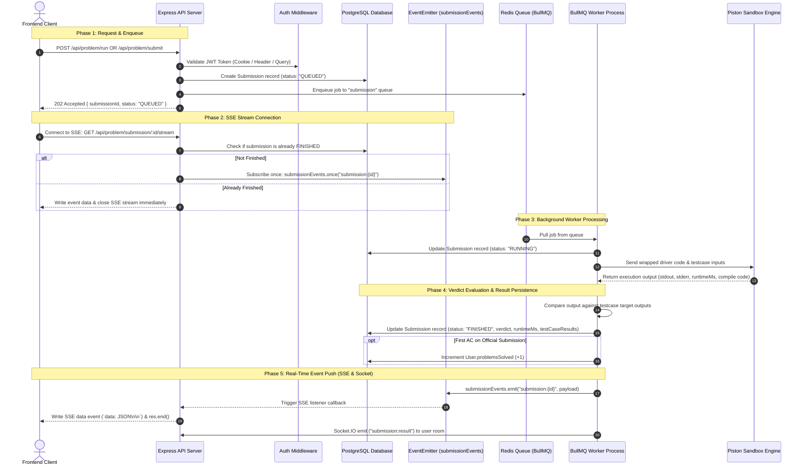

# ⚡ CodeRival — Complete Code Execution & Submission System Architecture (`SUBMISSION.md`)

This document provides an exhaustive, authoritative guide to the **Code Execution and Submission System** in **CodeRival**. It covers the complete architecture, data models, queue processing, Piston sandbox integration, Server-Sent Events (SSE) real-time streaming, verdict evaluation, and competitive match mechanics.

---

## 🎯 1. Overview & Core Philosophy

CodeRival is a high-performance competitive coding platform. Executing user code is inherently asynchronous, resource-intensive, and security-sensitive. 

### **Key Design Goals**:
1. **Non-Blocking Architecture**: Express API web servers offload heavy execution tasks to Redis background queues powered by **BullMQ**.
2. **Zero-Polling Real-Time Feedback**: Standard HTTP polling loops (`GET /api/problem/submission/:id` in 1s intervals) have been **completely eliminated**. Results are delivered instantaneously via **Server-Sent Events (SSE)** for practice problems and **WebSockets (Socket.IO)** for live 1v1 battle matches.
3. **Isolated & Secure Sandboxing**: User code runs inside isolated **Piston** containers with strict CPU, memory, process count, and execution time limits.
4. **Deterministic Verdict Evaluation**: Testcases are evaluated against expected target outputs with exact matching, whitespace handling, and structured per-testcase feedback.

---

## 🔄 2. Submission Types

| Submission Type | Route / Event | Scope | DB Progression Effect | Real-Time Delivery Channel |
| :--- | :--- | :--- | :--- | :--- |
| **`RUN`** | `POST /api/problem/run` | Sample test cases only | None (Practice run) | Server-Sent Events (SSE Stream) |
| **`SUBMIT`** (Practice) | `POST /api/problem/submit` | Complete problem test suite | Increments `User.problemsSolved` on first AC | Server-Sent Events (SSE Stream) |
| **`SUBMIT`** (1v1 Battle) | Socket emit `match:submit` | Complete problem test suite | Triggers $K=32$ ELO calculation, sets match winner | Socket.IO (`match:submission_result`) |

---

## 🏗️ 3. End-to-End Execution & Streaming Flow



---

## 📡 4. Server-Sent Events (SSE) Real-Time Streaming

CodeRival uses **Server-Sent Events (SSE)** for delivering practice code execution results.

### **Why SSE Replaced HTTP Polling**:
- **Zero Request Overhead**: Polling sends dozens of HTTP requests per submission, causing server load and DB connection pool pressure. SSE keeps 1 open HTTP connection that closes the millisecond execution completes.
- **Ultra-Low Latency**: User receives results within **<50ms** of execution finishing.
- **Native Browser Compatibility**: Utilizes standard browser `EventSource` API with automatic reconnection resilience.

### **SSE Backend Implementation (`problem.controller.ts`)**:

```typescript
export const streamSubmissionStatus = asyncHandler(async (req: Request, res: Response) => {
  const submissionId = String(req.params.submissionId);
  const userId = req.user?.userId;

  // 1. Set required SSE HTTP headers
  res.setHeader("Content-Type", "text/event-stream");
  res.setHeader("Cache-Control", "no-cache, no-transform");
  res.setHeader("Connection", "keep-alive");
  res.setHeader("X-Accel-Buffering", "no"); // Prevent proxy response buffering (Nginx)
  res.flushHeaders();

  // 2. Send initial connection ping comment
  res.write(": ping\n\n");

  // 3. Race condition check: Check if worker finished before client connected
  const existing = await SubmissionService.getSubmissionById(submissionId, userId!);
  if (existing && existing.status === SubmissionStatus.FINISHED) {
    res.write(`data: ${JSON.stringify({
      submissionId: existing.id,
      status: existing.status,
      verdict: existing.verdict,
      runtimeMs: existing.runtimeMs,
      totalTestCases: existing.totalTestCases,
      passedTestCases: existing.passedTestCases,
      stderr: existing.stderr,
      testCaseResults: existing.testCaseResults,
    })}\n\n`);
    res.end();
    return;
  }

  // 4. Register event listener on Node.js EventEmitter
  const onFinished = (data: any) => {
    res.write(`data: ${JSON.stringify(data)}\n\n`);
    res.end();
  };

  submissionEvents.once(`submission:${submissionId}`, onFinished);

  // 5. Cleanup listener if client disconnects prematurely
  req.on("close", () => {
    submissionEvents.removeListener(`submission:${submissionId}`, onFinished);
  });
});
```

### **Frontend SSE Client Implementation (`subscribeToSubmissionStream`)**:

```typescript
const subscribeToSubmissionStream = (submissionId: string): Promise<any> => {
  return new Promise((resolve, reject) => {
    const baseUrl = process.env.NEXT_PUBLIC_API_URL || 'http://localhost:8000/api'
    const eventSource = new EventSource(`${baseUrl}/problem/submission/${submissionId}/stream`, {
      withCredentials: true, // Transmits HttpOnly authentication cookie
    })

    // Safety timeout (60 seconds)
    const timeoutId = setTimeout(() => {
      eventSource.close()
      reject(new Error('Submission execution timed out.'))
    }, 60000)

    eventSource.onmessage = (event) => {
      try {
        clearTimeout(timeoutId)
        const data = JSON.parse(event.data)
        eventSource.close()
        resolve(data)
      } catch (err) {
        clearTimeout(timeoutId)
        eventSource.close()
        reject(err)
      }
    }

    eventSource.onerror = () => {
      clearTimeout(timeoutId)
      eventSource.close()
      reject(new Error('Server-sent event stream failed.'))
    }
  })
}
```

---

## 📦 5. Sandbox Code Execution Engine

Code execution is performed by **Piston** (`piston.service.ts` & `execution.service.ts`).

### **Supported Programming Languages**:

| Language Enum | Piston Runtime | Version | File Extension |
| :--- | :--- | :--- | :--- |
| **`PYTHON`** | `python` | `3.10.0` | `main.py` |
| **`CPP`** | `gcc` (g++) | `10.2.0` | `main.cpp` |
| **`JAVA`** | `java` (OpenJDK) | `15.0.2` | `Main.java` |

### **Hidden Driver Code Generator (`driverGenerator.ts`)**:
User solution code is wrapped inside a hidden harness before being sent to Piston. The harness deserializes testcase arguments from `stdin` as structured JSON, invokes the user solution method, and prints outputs to `stdout`.

### **Verdict Resolution Table**:

| Verdict | Name | Triggers / Cause |
| :--- | :--- | :--- |
| **`AC`** | Accepted | All testcase outputs match target expectations exactly. |
| **`WA`** | Wrong Answer | Solution executed cleanly but returned output mismatch for 1 or more testcases. |
| **`TLE`** | Time Limit Exceeded | Execution exceeded problem `timeLimitMs` or Piston returned `SIGKILL`. |
| **`CE`** | Compilation Error | Code failed compiler step (GCC / javac exit code $\ne 0$). |
| **`RTE`** | Runtime Error | Exception thrown during execution (Python traceback, ZeroDivisionError, NullPointer, etc.). |
| **`IE`** | Internal Error | Internal system error or container/network execution engine failure. |

---

## ⚔️ 6. 1v1 Battle Submissions & ELO Calculations

In live 1v1 battle matches:
1. User clicks "Submit Solution" on the battle interface (`battles/[id]/page.tsx`).
2. Client emits `match:submit` event over Socket.IO.
3. Socket server creates submission and enqueues job into BullMQ.
4. When `submission.worker.ts` finishes processing:
   - Evaluates verdict.
   - If verdict is **`AC`**, invokes `handleMatchSubmission(...)` in `match.service.ts`.
   - Triggers an **atomic database transaction**:
     - Calculates new ELO ratings using standard $K=32$ formula.
     - Updates winner's rating upward and loser's rating downward.
     - Marks match state as `FINISHED` with `winnerId`.
     - Emits `match:submission_result` and `match:ended` to all participants in the match room.

---

## 🔒 7. Security, Rate Limiting & Infrastructure

### **Rate Limiters (`submission.ratelimit.ts`)**:
- **`runCodeLimiter`**: Max 10 code runs per minute per IP/User.
- **`submitCodeLimiter`**: Max 5 official submissions per minute per IP/User.

### **Authentication Security (`auth.middleware.ts`)**:
The authentication middleware extracts JWT tokens flexibly across three sources:
1. **HttpOnly Cookie**: `req.cookies.token` (Primary for standard API and EventSource requests)
2. **Query String**: `req.query.token` (Fallback for EventSource endpoints)
3. **Authorization Header**: `req.headers.authorization` (`Bearer <token>`)

---

## 📂 8. Core File Reference & Responsibilities

```
backend/src/
├── modules/
│   ├── submission/
│   │   ├── submission.events.ts       # EventEmitter instance for SSE real-time notification
│   │   ├── submission.queue.ts        # BullMQ queue & metric helpers
│   │   ├── submission.worker.ts       # Main job consumer loop & database updater
│   │   ├── submission.service.ts      # Submission creation & BullMQ queue pusher
│   │   ├── execution.service.ts       # Driver wrapping & testcase comparator
│   │   ├── piston.service.ts          # HTTP client communicating with Piston sandbox
│   │   ├── submission.types.ts        # TypeScript interfaces
│   │   └── submission.ratelimit.ts    # Redis sliding-window limiters
│   └── problem/
│       ├── problem.controller.ts      # SSE endpoint (streamSubmissionStatus), /run, /submit
│       └── problem.routes.ts          # Express route definitions
frontend/src/
└── app/
    ├── problems/[slug]/page.tsx       # Practice arena UI with subscribeToSubmissionStream
    └── battles/[id]/page.tsx          # 1v1 Battle arena UI with SSE stream & socket handlers
```
